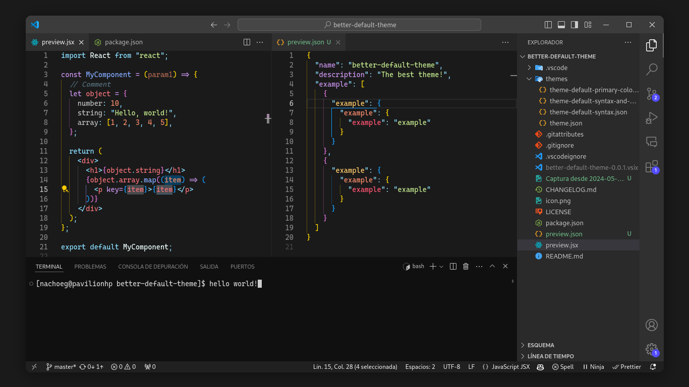

# Better Default Theme

My personal dark theme for Visual Studio Code, it's like the default one, but a bit better.

## Installation

1. Open the **Extensions** sidebar in VS Code.
2. Search for `Better Default`
3. Click **Install** to install it
4. Code > Preferences > Color Theme > **Better Default**

## Suggested settings

Open the Command Palette (Ctrl+Shift+P) and find "Open User Settings (JSON)". Here are the recommended settings:

    "workbench.sideBar.location": "right",
    "breadcrumbs.enabled": false,
    "editor.stickyScroll.enabled": true,
    "editor.minimap.enabled": false,
    "editor.cursorBlinking": "smooth",
    "editor.guides.bracketPairs": true,
    "editor.guides.highlightActiveBracketPair": true,
    "editor.bracketPairColorization.independentColorPoolPerBracketType": true,

#### Font (you may need to [install Cascadia Code PL](https://github.com/microsoft/cascadia-code/wiki/Installing-Cascadia-Code))

    "editor.fontFamily": "Cascadia Code PL",
    "editor.fontLigatures": true,
    "editor.fontWeight": "450",
